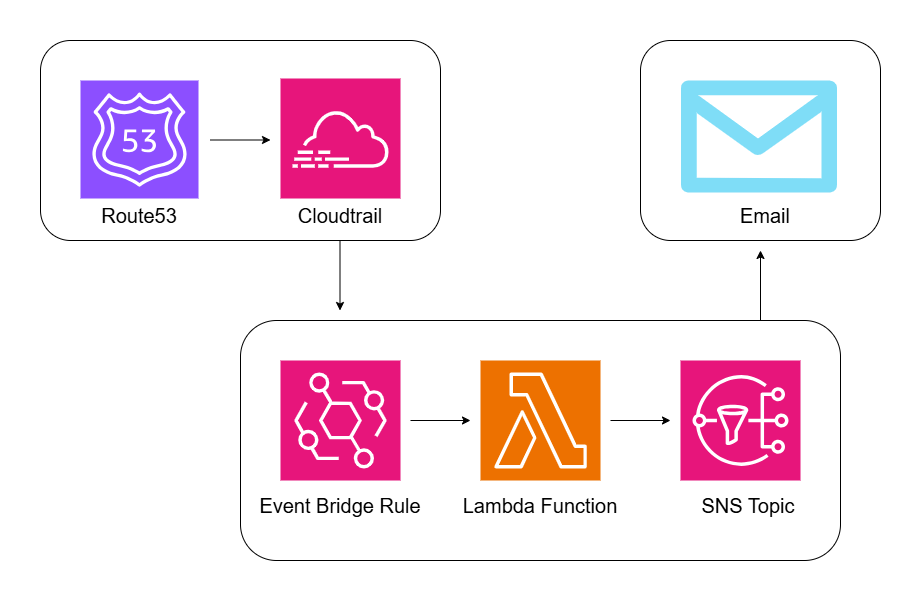
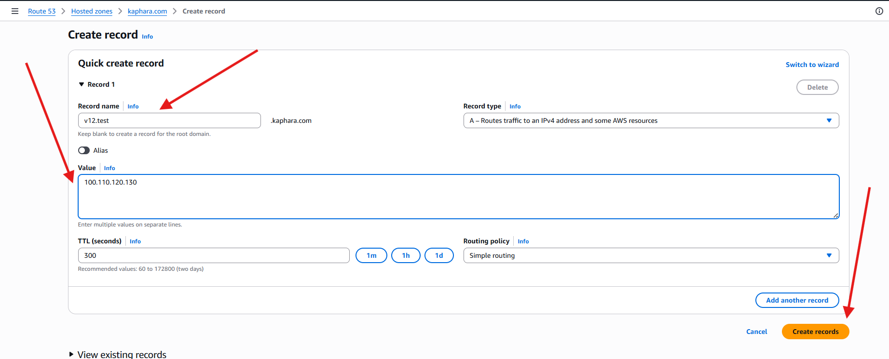
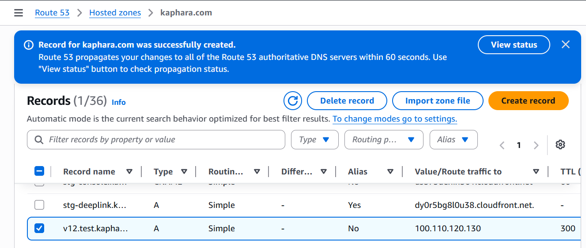
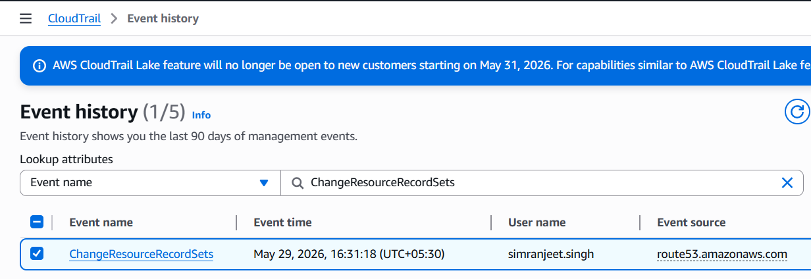
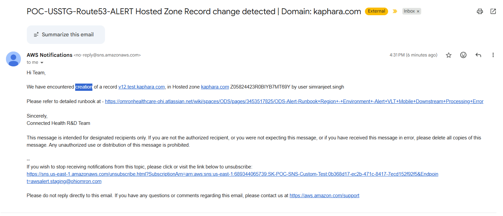
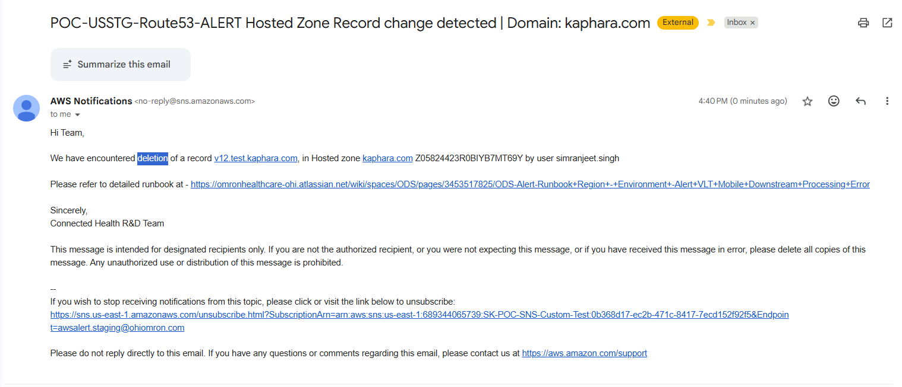

# Route53 DNS Change Monitoring

Automated email alerting system that detects any DNS record changes across all Route53 hosted zones and notifies the team via email.

---

## How It Works

1. Any DNS record change made in Route53 triggers a `ChangeResourceRecordSets` API call.
2. AWS CloudTrail captures this API call as a management event.
3. An EventBridge rule listens for this specific event and matches it using a defined event pattern.
4. EventBridge invokes a Lambda function, passing the full event payload.
5. Lambda extracts the relevant details — hosted zone, record name, action, and the IAM user who made the change.
6. Lambda sends a formatted plain-text email alert via Amazon SES to the team.

---

## Architecture



---

## AWS Components

| Component | Purpose |
|---|---|
| AWS CloudTrail | Captures Route53 API calls as management events |
| Amazon EventBridge | Listens for `ChangeResourceRecordSets` events and triggers Lambda |
| AWS Lambda | Parses the event and sends the email alert |
| Amazon Route53 | Source of DNS change events; also queried to resolve hosted zone names |
| Amazon SES | Sends the formatted email alert |

---

## Workflow

## New Record creation in Hosted Zone







## Cloudtrail logs gets generated



## EventBridge Rule


The rule listens for CloudTrail events originating from Route53 where the API call is `ChangeResourceRecordSets`. It matches across all hosted zones in the account.

### Event Pattern

```json
{
  "source": ["aws.route53"],
  "detail-type": ["AWS API Call via CloudTrail"],
  "detail": {
    "eventSource": ["route53.amazonaws.com"],
    "eventName": ["ChangeResourceRecordSets"]
  }
}
```

### Screenshots

**Rule Overview**


**Edit Rule View**


---

## Lambda Function

The Lambda function receives the full EventBridge event payload and performs the following:

- Extracts the hosted zone ID, record name, change action (creation/deletion/modification), and the IAM user who triggered the change.
- Calls `route53:ListHostedZones` to resolve the hosted zone ID to a human-readable domain name.
- Builds a plain-text email and sends it via SES.

### Screenshot


### Lambda Function Code


<details>
  <summary>Code</summary>

  ```python
import boto3
import json
import logging

logger = logging.getLogger()
logger.setLevel(logging.INFO)

SENDER_EMAIL    = "awsalert.staging@ohiomron.com"
RECIPIENT_EMAIL = "awsalert.staging@ohiomron.com"
AWS_REGION      = "us-east-1"
RUNBOOK_URL     = "https://omronhealthcare-ohi.atlassian.net/wiki/spaces/ODS/pages/3453517825/ODS-Alert-Runbook+Region+-+Environment+-Alert+VLT+Mobile+Downstream+Processing+Error"

route53 = boto3.client("route53")
ses     = boto3.client("ses", region_name=AWS_REGION)


def get_zone_name(zone_id):
    try:
        clean_id = zone_id.split("/")[-1]
        paginator = route53.get_paginator("list_hosted_zones")
        for page in paginator.paginate():
            for zone in page["HostedZones"]:
                if zone["Id"].split("/")[-1] == clean_id:
                    return zone["Name"].rstrip(".")
    except Exception as e:
        logger.warning(f"Could not resolve zone name for {zone_id}: {e}")
    return zone_id


def get_action_word(change_batch):
    changes = change_batch.get("changes", change_batch.get("Changes", []))
    if not changes:
        return "modification"
    action = changes[0].get("action", changes[0].get("Action", "UPSERT")).upper()
    if action == "CREATE":
        return "creation"
    elif action == "DELETE":
        return "deletion"
    else:
        return "modification"


def get_record_name(change_batch):
    changes = change_batch.get("changes", change_batch.get("Changes", []))
    if not changes:
        return "N/A"
    rrs = changes[0].get("resourceRecordSet", changes[0].get("ResourceRecordSet", {}))
    return rrs.get("name", rrs.get("Name", "N/A")).rstrip(".")


def lambda_handler(event, context):
    logger.info("Received event: %s", json.dumps(event))

    detail        = event.get("detail", {})
    req_params    = detail.get("requestParameters", {})
    user_identity = detail.get("userIdentity", {})

    zone_id      = req_params.get("hostedZoneId", "N/A")
    caller       = (
        user_identity.get("userName")
        or user_identity.get("arn")
        or user_identity.get("type")
        or "N/A"
    )
    change_batch  = req_params.get("changeBatch", {})

    zone_name     = get_zone_name(zone_id) if zone_id != "N/A" else "N/A"
    action_word   = get_action_word(change_batch)
    record_name   = get_record_name(change_batch)
    clean_zone_id = zone_id.split("/")[-1] if zone_id != "N/A" else "N/A"

    subject = f"POC-USSTG-Route53-ALERT Hosted Zone Record change detected | Domain: {zone_name}"

    body_text = f"""Hi Team,

We have encountered {action_word} of a record {record_name}, in Hosted zone {zone_name} {clean_zone_id} by user {caller}

Please refer to detailed runbook at - {RUNBOOK_URL}

Sincerely,
Connected Health R&D Team

This message is intended for designated recipients only. If you are not the authorized recipient, or you were not expecting this message, or if you have received this message in error, please delete all copies of this message. Any unauthorized use or distribution of this message is prohibited."""

    try:
        ses.send_email(
            Source=SENDER_EMAIL,
            Destination={"ToAddresses": [RECIPIENT_EMAIL]},
            Message={
                "Subject": {"Data": subject, "Charset": "UTF-8"},
                "Body": {
                    "Text": {"Data": body_text, "Charset": "UTF-8"},
                },
            },
        )
        logger.info("Alert email sent successfully.")
    except Exception as e:
        logger.error(f"Failed to send email: {e}")
        raise

    return {"statusCode": 200, "body": "Alert sent."}
```

</details>

---

## IAM Policy

The Lambda execution role requires the following permissions. The SES permission is scoped down to the specific sender identity only.

### Code

<details>
  <summary>Code</summary>

  ```json
{
  "Version": "2012-10-17",
  "Statement": [
    {
      "Sid": "Route53ListZones",
      "Effect": "Allow",
      "Action": [
        "route53:ListHostedZones"
      ],
      "Resource": "*"
    },
    {
      "Sid": "SESSendEmail",
      "Effect": "Allow",
      "Action": [
        "ses:SendEmail"
      ],
      "Resource": "arn:aws:ses:us-east-1:YOUR_ACCOUNT_ID:identity/awsalert.staging@ohiomron.com"
    },
    {
      "Sid": "CloudWatchLogs",
      "Effect": "Allow",
      "Action": [
        "logs:CreateLogGroup",
        "logs:CreateLogStream",
        "logs:PutLogEvents"
      ],
      "Resource": "arn:aws:logs:*:YOUR_ACCOUNT_ID:log-group:/aws/lambda/*"
    }
  ]
}
```

</details>


> Replace `YOUR_ACCOUNT_ID` with your actual AWS account ID.

---

## Email Alert

The email subject reflects the type of change (creation, deletion, or modification) and the affected domain. The body identifies the record, hosted zone, and the IAM user who made the change.




### Same alert for deletion of record



---

## Prerequisites

- CloudTrail must be enabled with management events logging turned on in `us-east-1` (Route53 is a global service but logs to `us-east-1`).
- The sender email address must be a verified identity in SES.
- If SES is still in sandbox mode, the recipient email must also be verified.

---

## Repository Structure

```
.
├── Images/
│   ├── architecture-placeholder.png
│   ├── eventbridge-rule-placeholder.png
│   ├── eventbridge-edit-rule-placeholder.png
│   ├── lambda-function-placeholder.png
│   └── email-alert-placeholder.png
├── event-bridge-rule-pattern.json
├── lambda-function.py
├── lambda-function-iam-policy.json
└── README.md
```
